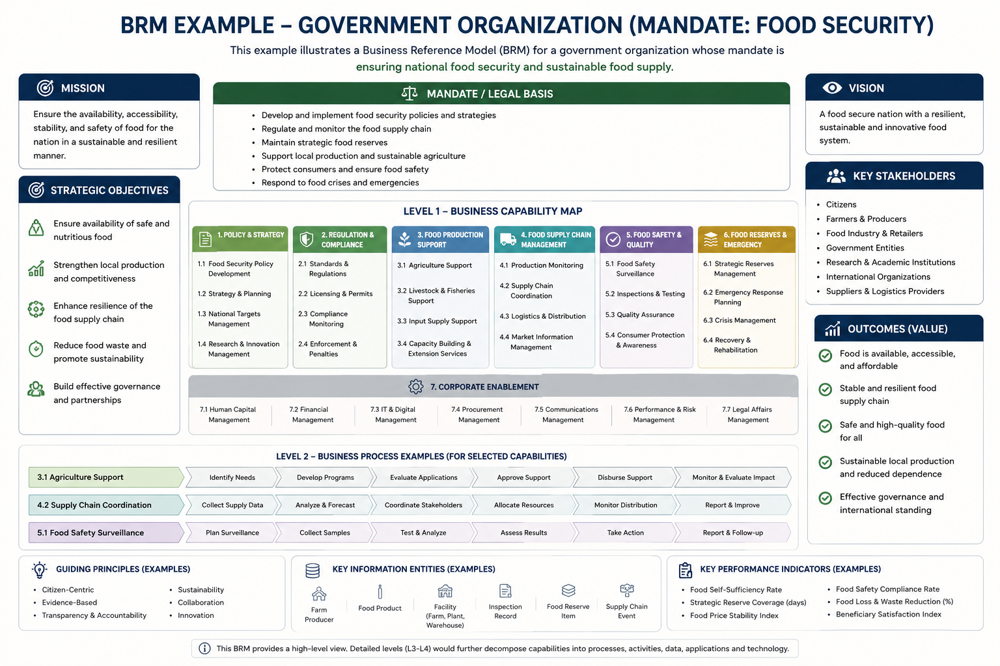
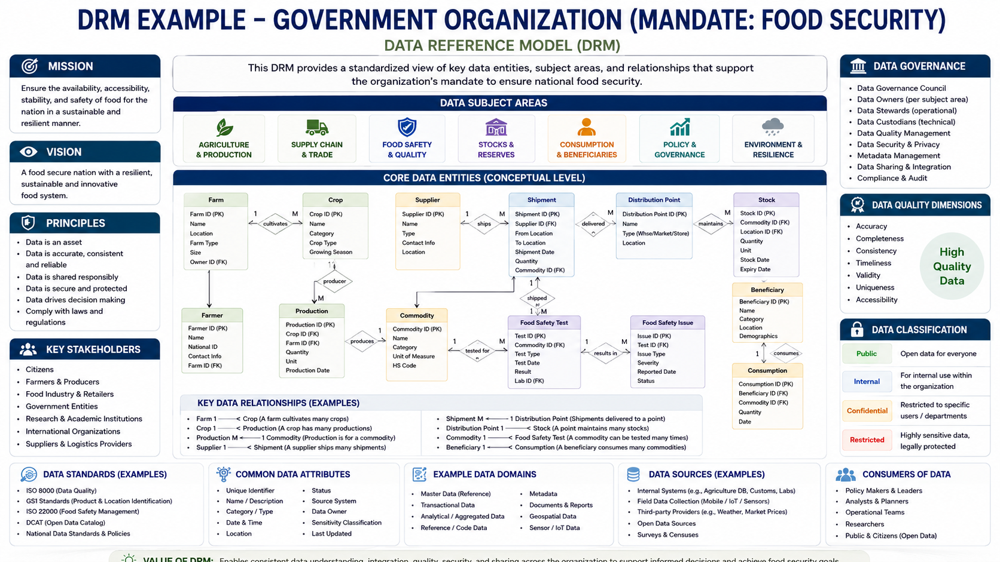
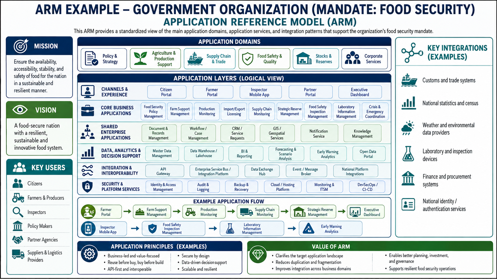

# Reference Models Implementation Plan

## Actual Progress Summary

Reviewed on **2026-07-20** against the current workspace. The core Reference Models product surface is implemented; the full plan is **86% complete** when the status checklist below is counted literally (**12 of 14** checklist items done).

| Area | Actual progress | Status | Evidence checked | Open work |
|------|----------------:|--------|------------------|-----------|
| Overall full plan | **86%** | Mostly complete | 12/14 status checkboxes are `[x]`; backend, frontend, seed, routes, permissions, workspace transfer, and tests are present | Docs/screenshots; further seed-only models beyond the six launch sets |
| Core MVP / product surface | **100%** | Built | Navigation/routes, landing, per-domain browse page, hierarchy/map/table/coverage/unmapped views, mapping UI, admin UI, report view | None for MVP acceptance |
| Backend | **100%** | Built | Models, migrations `149`/`155`/`156`/`157`/`159`, API router registration, permissions, seed data, workspace transfer sections, API tests | None found in plan scope |
| Frontend | **100%** | Built | `features/reference-models/`, lazy routes, nav dropdown, management page, dialogs, coverage, relationship surface | No dedicated frontend unit tests listed for this RM plan |
| Governance, versioning, relationships | **100%** | Built | Publish/reject/archive flow, frozen versions + diff, narrative, import/export, component relationships API and UI | None found in plan scope |
| Documentation and screenshots | **0%** | Open | No Reference Models docs pages or screenshot entries found under `docs/` / `scripts/screenshots/pages.ts` | Add docs in all required locales and screenshot automation |
| Future model expansion | **0%** | Deferred | Six launch sets exist: BRM, ARM, DRM, TRM, BXRM, SRM | Add additional seed-only models if needed |

**Percentage basis:** equal-weight count of the explicit status checklist in section 0: `(12 done / 14 total) * 100 = 85.7%`, rounded to **86%**. If deferred future model expansion is excluded from the delivery scope, the remaining gap is documentation/screenshots only and the plan is **92% complete** by the same checklist method.

## 0. Implementation Status

> **Status: CORE BUILT; FULL PLAN 86% COMPLETE (shipped in commit `ed4f9c71` —
> "full RMPlan build").** The feature is implemented end-to-end and wired into
> navigation, permissions, and the demo seed. The remaining gap is productization
> collateral plus optional future model expansion. This section tracks the plan
> against the code as of 2026-07-20.

**Backend**
- [x] **Data model** (migrations `149`, `155`, `156`, `157`, `159`) — `reference_models`, `reference_model_items` (self-referential `parent_id` component tree, uniquely coded), `reference_model_mappings` (item ↔ inventory card), `reference_model_versions` (frozen snapshots), and `reference_model_relationships` (§10 — typed cross-model item↔item links: supports / consumes / realizes / depends_on / aligns_with).
- [x] **API** (`api/v1/reference_models.py`, registered in `router.py`) — active/overview/summary, per-item mapped cards, mapping CRUD, unmapped-inventory, gaps/coverage, narrative, versions + version diff, draft→submit→publish/reject workflow, archive, item CRUD, import/export, and (§10) `relationship-types` + per-item relationship list/create/delete.
- [x] **Permissions** — `reference_models.view` / `.manage` / `.map` (in `core/permissions.py`); relationship writes reuse `.map`.
- [x] **Seed** (`seed_reference_models.py`) — **six** launch models: **BRM** (8 items), **ARM** (16), **DRM** (9), **TRM** (9), **BXRM** Beneficiary Experience (10), **SRM** Security (10), all bilingual (English + Arabic).
- [x] **Workspace transfer** — all five RM tables wired into `ENTITY_SECTIONS` (`workspace_io/sections.py`), relationships after items so both item FKs resolve verbatim.
- [x] **Tests** — `tests/api/test_reference_models.py` incl. the §10 relationship create/list/delete + duplicate/self/permission guards.

**Frontend** (`features/reference-models/`)
- [x] **Page 1 — Landing** (`browse/ReferenceModelsLanding.tsx`), route `/reference-models`.
- [x] **Page 2 — Overview** + **Page 3 — Component details** (`browse/ReferenceModelBrowsePage.tsx` incl. view modes), route `/reference-models/:domain`.
- [x] **Page 4 — Mapped inventory** (`browse/MappingDialog.tsx`) + **Page 5 — Coverage & gaps** (`browse/ReferenceModelCoverage.tsx`), plus `ReferenceModelCapabilityMap.tsx`, `ReferenceModelPoster.tsx`, `NarrativeEditor.tsx`, `VersionsDialog.tsx`.
- [x] **Page 6 — Administration** (`ReferenceModelsPage.tsx`), route `/reference-models/manage`; report view at `/reports/reference-models`.
- [x] Nav dropdown + lazy routes in `App.tsx`.

**Remaining / deferred**
- [ ] Docs (`docs/`) + screenshots (`scripts/screenshots/pages.ts`) across all 8 locales.
- [x] **Frontend surface for §10 relationships** — the component-detail drawer (`ReferenceModelBrowsePage.tsx`) now lists outgoing + incoming relationships with the related component, its model, and a delete action; **Add relationship** opens `RelationshipDialog.tsx` (target-model → component picker + type + description), gated on `reference_models.map`.
- [ ] Further models beyond the six launch sets (e.g. an Experience RM variant) — the schema is model-type-agnostic, so these are seed-only additions.

---

## 1. Purpose

Implement Reference Models as a new functional area in Turbo EA so users can:

1. Open a Reference Model from the main navigation.
2. View the complete model as a visual hierarchy.
3. Open any Reference Model component and review its details.
4. See the real inventory records mapped to that component.
5. identify missing coverage, duplication, and unmapped inventory.
6. Use the Reference Model as a navigation and analysis structure rather than as a static diagram.

The first supported models should be:

- Business Reference Model — BRM
- Data Reference Model — DRM
- Application Reference Model — ARM
- Technology Reference Model — TRM

The design should remain extensible so additional models can be added later, such as Security Reference Model or Experience Reference Model.

---

## 2. Main User Journey

```text
Main Navigation
    ↓
Reference Models dropdown
    ↓
Choose BRM, DRM, ARM, or TRM
    ↓
Reference Model Overview
    ↓
Select a domain, area, or reference component
    ↓
Reference Model Component Details
    ↓
Open mapped inventory results
    ↓
Review coverage, gaps, duplication, and unmapped records
```

The core navigation pattern is:

```text
Reference Model → Reference Component → Mapped Inventory → Analysis
```

---

## 3. Navigation Changes

Add a new main navigation item named **Reference Models**.

It should behave as a dropdown menu.

### Proposed navigation

```text
Dashboard
Inventory
Architecture Views
Reference Models ▾
    Business Reference Model
    Data Reference Model
    Application Reference Model
    Technology Reference Model
Governance
Administration
```

### Navigation behavior

- Selecting **Reference Models** may open a landing page listing all available models.
- Selecting one model from the dropdown opens its overview page directly.
- The currently selected model should remain highlighted.
- The menu must support role-based visibility if permissions are implemented later.
- Arabic labels and RTL layout must be supported.

### Suggested routes

```text
/reference-models
/reference-models/brm
/reference-models/drm
/reference-models/arm
/reference-models/trm
/reference-models/:modelId
/reference-models/:modelId/components/:componentId
/reference-models/:modelId/components/:componentId/inventory
/reference-models/:modelId/coverage
```

---

## 4. Page 1 — Reference Models Landing Page

### Purpose

Provide one entry page showing all available Reference Models and their current status.

### Main content

- Page title: **Reference Models**
- Short explanation of how Reference Models are used.
- Cards for BRM, DRM, ARM, and TRM.
- Model owner.
- Model version.
- Approval status.
- Number of model components.
- Number of mapped inventory records.
- Coverage percentage.
- Last updated date.

### Card actions

- Open model
- View coverage
- View unmapped inventory
- Manage model, when the user has permission

### Example metrics

```text
BRM
Components: 42
Mapped capabilities/services: 38
Coverage: 90%
Status: Approved

ARM
Components: 36
Mapped applications: 72
Coverage: 83%
Status: Draft
```

---

## 5. Page 2 — Reference Model Overview

Create one reusable page template that works for BRM, DRM, ARM, and TRM.

### Purpose

Show the entire Reference Model as an understandable hierarchy and allow the user to navigate into any model component.

### Header

Display:

- Reference Model name
- Code, such as ARM
- Version
- Status
- Owner
- Effective date
- Source or baseline, such as NORA plus organization customization
- Description

### Header actions

- Edit model
- Add component
- Import
- Export
- Change view
- View coverage
- View unmapped inventory

### Required view modes

#### A. Visual hierarchy view

Show the model as domains, areas, and reference components.

Example:

```text
Application Reference Model
├── Core Mission Applications
│   ├── Food Supply Monitoring
│   ├── Strategic Reserve Management
│   ├── Import and Export Monitoring
│   └── Early Warning and Alerts
├── Shared Business Applications
│   ├── Case Management
│   ├── Workflow Management
│   └── Document Management
└── Corporate Applications
    ├── ERP
    ├── Human Resources
    └── Procurement
```

#### B. Tree view

- Expand and collapse hierarchy.
- Show component code, name, status, and mapping count.
- Support quick search.

#### C. Table view

Recommended columns:

- Code
- Component name
- Level
- Parent
- Description
- Owner
- Status
- Version
- Mapped inventory count
- Coverage status
- Actions

#### D. Coverage view

Use coverage indicators:

- Fully mapped
- Partially mapped
- Not mapped
- Has duplicate inventory support
- Has unmapped inventory candidates

### Component interaction

When a user selects a component:

- Open a summary side panel, or
- Navigate to the component details page.

The preferred default is to open a side panel for quick review and provide an **Open full details** action.

---

## 6. Page 3 — Reference Model Component Details

### Purpose

Provide the authoritative details of one Reference Model component.

### Example breadcrumb

```text
Reference Models / ARM / Core Mission Applications / Food Supply Monitoring
```

### Main details

- Component name
- Component code
- Reference Model
- Component level
- Parent component
- Definition
- Purpose
- Scope
- Exclusions
- Owner
- Steward
- Status
- Version
- Effective date
- Source or baseline
- Customization notes
- Tags

### Relationship sections

Display linked records in separate tabs or sections.

#### General tabs

- Overview
- Child components
- Inventory mappings
- Relationships
- Principles and standards
- Analysis
- Change history

#### Model-specific mapping tabs

**BRM**

- Business capabilities
- Business services
- Business processes
- Organization units
- Stakeholders

**DRM**

- Data domains
- Data entities
- Data products
- Data stores
- Data exchanges
- Data owners and stewards

**ARM**

- Applications
- Application services
- Application modules
- Integrations
- Business capabilities supported

**TRM**

- Technology products
- Technology services
- Platforms
- Infrastructure components
- Standards

### Main call-to-action

Provide a visible action:

```text
View mapped inventory (12)
```

Also provide:

```text
View possible mapping candidates (5)
```

This second action can later use rules or AI-assisted suggestions, but the first implementation can use manually selected candidates or matching tags.

---

## 7. Page 4 — Mapped Inventory Results

### Purpose

Show the actual repository records connected to a selected Reference Model component.

### Example

```text
ARM / Food Supply Monitoring / Mapped Applications
```

### Filters

- Name
- Inventory type
- Owner
- Lifecycle
- Status
- Criticality
- Organization unit
- Mapping type
- Mapping confidence
- Compliance status

### Recommended columns

- Inventory item name
- Inventory type
- Owner
- Lifecycle
- Criticality
- Status
- Mapping type
- Mapping rationale
- Mapping status
- Last reviewed
- Actions

### Mapping types

- Primary
- Secondary
- Supporting
- Candidate
- Historical

### Available actions

- Open inventory record
- Remove mapping
- Change mapping type
- Add mapping rationale
- Compare mapped items
- Export results

### Important analysis indicators

- No inventory mapped
- One inventory item mapped
- Multiple inventory items mapped
- Possible duplication
- Inventory scheduled for retirement
- Inventory with no owner
- Inventory that does not comply with linked standards

---

## 8. Page 5 — Coverage and Gap Analysis

### Purpose

Turn the Reference Model into a decision-support capability.

### Main metrics

- Total Reference Model components
- Fully covered components
- Partially covered components
- Uncovered components
- Total mapped inventory records
- Unmapped inventory records
- Components with duplicate supporting systems
- Components supported only by retiring inventory

### Required analysis views

#### Coverage matrix

```text
Reference Component | Inventory Count | Coverage | Lifecycle Risk | Standards Compliance
```

#### Gap list

Examples:

- Reference component has no mapped inventory.
- Component is supported only by a retiring application.
- Multiple applications provide the same primary function.
- Inventory record is not mapped to any Reference Model component.
- Mapped application does not comply with required standards.

#### Unmapped inventory

Show repository records that are not connected to the selected Reference Model.

Example:

```text
Unmapped applications: 14
Unmapped data entities: 122
Unmapped technology products: 29
```

### Gap actions

- Create initiative
- Create recommendation
- Add to roadmap
- Assign owner
- Mark as accepted gap
- Link to architecture decision

These actions may be delivered in a later phase if the related modules do not exist yet.

---

## 9. Page 6 — Reference Model Administration

### Purpose

Allow authorized users to create, customize, version, and maintain Reference Models.

### Model-level functions

- Create model
- Edit model details
- Clone model
- Archive model
- Set active version
- Submit for review
- Approve or reject
- Export model
- Import model

### Component-level functions

- Add component
- Edit component
- Move component
- Reorder component
- Change parent
- Archive component
- Merge components
- Add child component
- Map inventory
- Link standards and principles

### Recommended import/export formats

- CSV
- Excel
- JSON

A future phase may support ArchiMate exchange or another structured EA interchange format.

---

## 10. Data Model

The implementation should use generic Reference Model entities rather than separate database tables for every model type.

### Entity: `reference_model`

Suggested fields:

```text
id
code
name_en
name_ar
model_type
version
status
owner_id
description_en
description_ar
source
baseline_reference
is_active
effective_date
review_date
created_at
created_by
updated_at
updated_by
```

### Suggested `model_type` values

```text
BRM
DRM
ARM
TRM
SRM
XRM
CUSTOM
```

### Entity: `reference_model_component`

Suggested fields:

```text
id
reference_model_id
parent_component_id
code
name_en
name_ar
description_en
description_ar
purpose_en
purpose_ar
scope_en
scope_ar
exclusions_en
exclusions_ar
component_level
component_type
sort_order
owner_id
steward_id
status
version
source
customization_notes
is_active
created_at
created_by
updated_at
updated_by
```

### Entity: `reference_model_mapping`

Suggested fields:

```text
id
reference_model_id
reference_model_component_id
inventory_object_id
inventory_object_type
mapping_type
mapping_status
mapping_rationale
mapping_confidence
valid_from
valid_to
reviewed_at
reviewed_by
created_at
created_by
updated_at
updated_by
```

### Entity: `reference_model_relationship`

Use this for relationships between components or between a component and another governed object.

Suggested fields:

```text
id
source_component_id
target_object_id
target_object_type
relationship_type
description
created_at
created_by
```

### Entity: `reference_model_version`

Suggested fields:

```text
id
reference_model_id
version
status
change_summary
published_at
published_by
created_at
```

### Important design decision

Do not duplicate inventory records inside the Reference Model module.

The Reference Model should reference existing inventory objects through mappings.

```text
Reference Model component ≠ inventory record
Reference Model component → maps to → inventory record
```

---

## 11. Relationship Rules

### BRM mapping rules

```text
BRM component → Business Capability
BRM component → Business Service
BRM component → Business Process
BRM component → Organization Unit
```

### DRM mapping rules

```text
DRM component → Data Domain
DRM component → Data Entity
DRM component → Data Product
DRM component → Data Store
DRM component → Data Exchange
```

### ARM mapping rules

```text
ARM component → Application
ARM component → Application Module
ARM component → Application Service
ARM component → Integration
```

### TRM mapping rules

```text
TRM component → Technology Product
TRM component → Technology Service
TRM component → Platform
TRM component → Infrastructure Component
TRM component → Technology Standard
```

The system should allow one inventory record to map to multiple Reference Model components where justified.

---

## 12. API Plan

### Reference Models

```text
GET    /api/reference-models
POST   /api/reference-models
GET    /api/reference-models/{modelId}
PATCH  /api/reference-models/{modelId}
DELETE /api/reference-models/{modelId}
```

### Components

```text
GET    /api/reference-models/{modelId}/components
POST   /api/reference-models/{modelId}/components
GET    /api/reference-model-components/{componentId}
PATCH  /api/reference-model-components/{componentId}
DELETE /api/reference-model-components/{componentId}
```

### Mappings

```text
GET    /api/reference-model-components/{componentId}/mappings
POST   /api/reference-model-components/{componentId}/mappings
PATCH  /api/reference-model-mappings/{mappingId}
DELETE /api/reference-model-mappings/{mappingId}
```

### Analysis

```text
GET /api/reference-models/{modelId}/coverage
GET /api/reference-models/{modelId}/gaps
GET /api/reference-models/{modelId}/unmapped-inventory
GET /api/reference-model-components/{componentId}/mapping-candidates
```

### Import and export

```text
POST /api/reference-models/import
GET  /api/reference-models/{modelId}/export
```

---

## 13. Frontend Component Plan

Create reusable frontend components.

```text
ReferenceModelsNavMenu
ReferenceModelCard
ReferenceModelHeader
ReferenceModelViewSwitcher
ReferenceModelHierarchy
ReferenceModelTree
ReferenceModelTable
ReferenceModelComponentNode
ReferenceModelComponentPanel
ReferenceModelBreadcrumb
ReferenceModelCoverageBadge
ReferenceModelMappingTable
ReferenceModelMappingDialog
ReferenceModelCoverageSummary
ReferenceModelGapTable
ReferenceModelUnmappedInventoryTable
ReferenceModelImportDialog
ReferenceModelExportDialog
```

### State and filtering

Each model page should preserve:

- Selected view mode
- Search text
- Expanded tree nodes
- Filters
- Sort order
- Selected component

Where appropriate, store these in URL query parameters so views can be bookmarked and shared.

Example:

```text
/reference-models/arm?view=tree&status=active&selected=ARM-CORE-01
```

---

## 14. Permissions

Suggested permissions:

```text
reference_models.view
reference_models.create
reference_models.edit
reference_models.delete
reference_models.approve
reference_models.import
reference_models.export
reference_model_components.create
reference_model_components.edit
reference_model_components.delete
reference_model_mappings.create
reference_model_mappings.edit
reference_model_mappings.delete
```

Suggested roles:

- Viewer
- Architect
- Reference Model Owner
- EA Governance Reviewer
- Administrator

---

## 15. Audit and Governance

The module should record:

- Who created or changed a model.
- Who added, changed, or removed a mapping.
- Previous and new values.
- Date and time of change.
- Approval status changes.
- Published versions.

Reference Model versions should be preserved after publication.

A published model should not be silently overwritten. Changes should create a draft version or change record.

---

## 16. Arabic and RTL Requirements

- All model and component names must support English and Arabic.
- Descriptions, purposes, scopes, and rationale must support both languages.
- Tree connectors and hierarchy indentation must work correctly in RTL.
- Breadcrumbs must reverse naturally in RTL.
- Tables, filters, dialogs, badges, and visual nodes must support RTL.
- Codes such as `ARM-01` remain LTR inside Arabic pages.
- The navigation dropdown must align correctly in both languages.

---

## 17. Seed Data

Provide demo models so the feature can be tested immediately.

### BRM demo hierarchy

```text
Food Security Management
├── Food Supply Planning
├── Agricultural Production Oversight
├── Import and Export Management
├── Strategic Reserve Management
├── Food Distribution Monitoring
├── Food Safety Oversight
└── Food Security Risk and Early Warning
```

### DRM demo hierarchy

```text
Food Security Data
├── Food Production Data
├── Import and Export Data
├── Strategic Reserve Data
├── Supplier and Distributor Data
├── Market and Price Data
├── Beneficiary Consumption Data
├── Food Safety Data
└── Risk and Forecast Data
```

### ARM demo hierarchy

```text
Food Security Applications
├── Core Mission Applications
│   ├── Food Supply Monitoring
│   ├── Strategic Reserve Management
│   ├── Import and Export Monitoring
│   ├── Distribution Monitoring
│   └── Early Warning and Alerts
├── Shared Business Applications
│   ├── Case Management
│   ├── Workflow Management
│   ├── Document Management
│   └── Reporting and Analytics
└── Corporate Applications
    ├── ERP
    ├── Human Resources
    └── Procurement
```

### TRM demo hierarchy

```text
Technology Services
├── Hosting and Cloud
├── Integration Platform
├── Data Platform
├── Identity and Access Management
├── Monitoring and Observability
├── Network Services
├── End-user Computing
└── Security Technology Services
```

---

## 18. Expected Visual References

The following images are examples of the expected Reference Model overview style. They are design references, not strict final UI specifications.

### Business Reference Model example



### Data Reference Model example



### Application Reference Model example



### UI interpretation

The actual application should translate these images into interactive UI components:

- Each visual box becomes a selectable model component.
- Selecting a component opens details.
- Mapping counts appear on the component.
- Coverage state is displayed using badges or indicators.
- Users can switch between diagram, tree, and table views.
- The visual model should be generated from stored data, not uploaded as a fixed image.

---

## 19. Delivery Phases

### Phase 1 — Foundation

- Add Reference Models navigation dropdown.
- Create Reference Models landing page.
- Add generic Reference Model and component entities.
- Add BRM, DRM, ARM, and TRM seed models.
- Implement model overview in tree and table views.
- Implement component details page.
- Support English and Arabic fields.

### Phase 2 — Inventory Mapping

- Add mapping entity and APIs.
- Add mapping dialog.
- Show mapped inventory count on each component.
- Add mapped inventory results page.
- Add unmapped inventory page.
- Add mapping rationale and mapping type.

### Phase 3 — Visual Model View

- Add interactive visual hierarchy.
- Add zoom, pan, expand, and collapse where appropriate.
- Add component status and mapping coverage indicators.
- Add side panel for quick component review.
- Add export as image or PDF if supported.

### Phase 4 — Coverage and Analysis

- Add coverage dashboard.
- Add gap detection.
- Add duplicate-support detection.
- Add lifecycle risk indicators.
- Add standards compliance indicators.
- Add recommendations and roadmap links.

### Phase 5 — Governance and Versioning

- Add draft, review, approved, and archived statuses.
- Add approval workflow.
- Add version history.
- Add audit log.
- Add model comparison between versions.
- Add import and export.

### Phase 6 — Assisted Mapping

- Suggest inventory mapping candidates.
- Match using names, descriptions, tags, and relationships.
- Require human confirmation before saving suggested mappings.
- Record mapping confidence and review status.

---

## 20. Recommended MVP Scope

The first production MVP should include:

- Reference Models dropdown in the main navigation.
- BRM, DRM, ARM, and TRM routes.
- Reference Model overview page.
- Tree and table views.
- Reference Model component details page.
- Manual inventory mapping.
- Mapped inventory results.
- Mapping counts.
- Unmapped inventory list.
- Basic coverage indicators.
- Arabic and RTL support.

Do not delay the MVP for:

- AI-assisted mapping.
- Complex workflow.
- Advanced version comparison.
- PDF export.
- Sophisticated graph visualization.

---

## 21. Acceptance Criteria

The feature is accepted when:

1. A user can open **Reference Models** from the main navigation.
2. A user can choose BRM, DRM, ARM, or TRM from a dropdown.
3. Each model opens on its own route.
4. A model can be viewed as a tree and table.
5. A user can open a model component.
6. The component page displays its definition, purpose, parent, owner, and status.
7. A user can map existing inventory records to a model component.
8. A user can open the mapped inventory list from the model component.
9. The model shows how many inventory records are mapped to each component.
10. The system identifies model components with no mapping.
11. The system identifies inventory records with no Reference Model mapping.
12. English, Arabic, LTR, and RTL layouts work correctly.
13. Permissions prevent unauthorized editing.
14. Mapping changes are recorded in the audit history.

---

## 22. Final Design Principle

The Reference Model must not become a separate static catalog disconnected from the repository.

Its main value comes from connecting the model to real architecture inventory.

```text
Reference Model
    ↓ classifies
Architecture Inventory
    ↓ enables
Coverage, gap, duplication, lifecycle, and compliance analysis
    ↓ supports
Target architecture, investment decisions, and roadmaps
```
